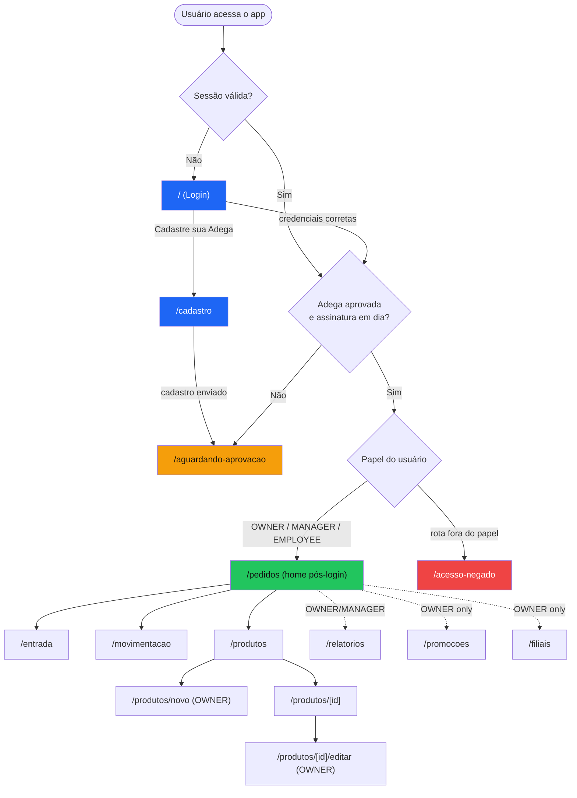
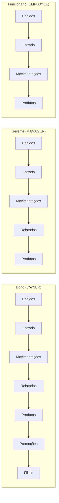
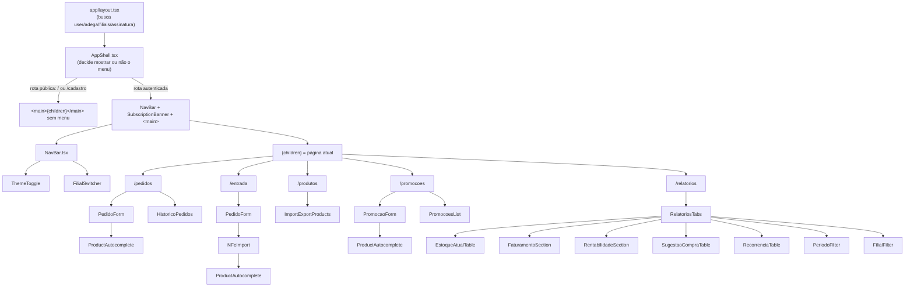
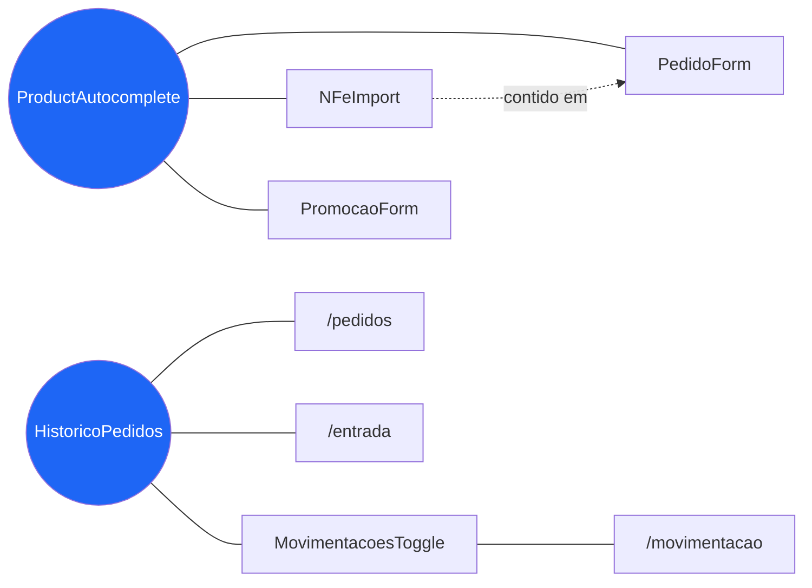
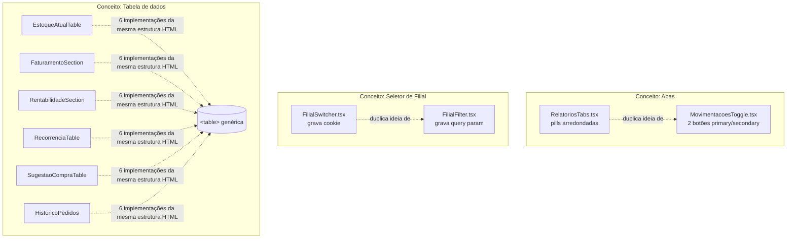

# EXPORT — Diagramas de Arquitetura Front-end (Omnix Connect)

> Complementa os 13 documentos em `/docs`. Diagramas em Mermaid — renderizam nativamente em GitHub, GitLab, Notion, VS Code (com extensão) e na maioria dos visualizadores de Markdown modernos.

## 1. Mapa de rotas

Inclui redirecionamentos condicionais (não é só a lista de arquivos — mostra o comportamento real de navegação).

## 2. Árvore de navegação (Sidebar) por papel

**Leitura**: cada papel vê um subconjunto estritamente decrescente de links — Funcionário não vê Relatórios/Promoções/Filiais; Gerente não vê Promoções/Filiais. Nenhum papel vê "Dashboard" ou "Configurações" porque essas rotas não existem hoje (ver `USER_FLOW_ANALYSIS.md`).

## 3. Relação Layout → Página → Componentes

## 4. Mapa de componentes reutilizados (grafo de reuso)

**Leitura**: `ProductAutocomplete` e `HistoricoPedidos` são os únicos 2 componentes do projeto com reuso real entre múltiplas telas (ver `COMPONENT_INVENTORY.md`, seção "Resumo de reuso"). Todo o resto do grafo de 25 componentes é composto de folhas de uso único — sintoma direto da ausência de Design System (`DESIGN_SYSTEM_ANALYSIS.md`).

## 5. Duplicações estruturais (para visualizar o `DESIGN_DEBT.md`)

---

## Screenshots organizadas por página

Ver `/docs/export/screenshots/README.md` — a captura de imagem não foi possível nesta sessão (ver nota técnica em `SCREENSHOTS.md`); a pasta contém a descrição de como as capturas devem ser organizadas quando regeradas.

## Diagramas não gerados automaticamente — como estruturá-los manualmente

Todos os diagramas solicitados foram gerados em Mermaid acima. Caso a equipe precise de uma versão em ferramenta visual (Figma/FigJam/Excalidraw) em vez de Mermaid:
- **Mapa de rotas**: reproduzir o diagrama 1 como fluxograma, mantendo os losangos de decisão (sessão válida? aprovado? papel?) — são exatamente as 3 condições que controlam todo redirecionamento no app (`lib/auth.ts` do ponto de vista de efeito na UI, não de implementação).
- **Árvore de navegação**: reproduzir o diagrama 2 como 3 colunas lado a lado (uma por papel), cada uma sendo a lista vertical exata que aparece na Sidebar real.
- **Mapa de componentes**: reproduzir o diagrama 4 como um grafo de nós, com o tamanho do nó proporcional ao número de telas que o consomem (útil para priorizar o que migrar primeiro pro Design System).
